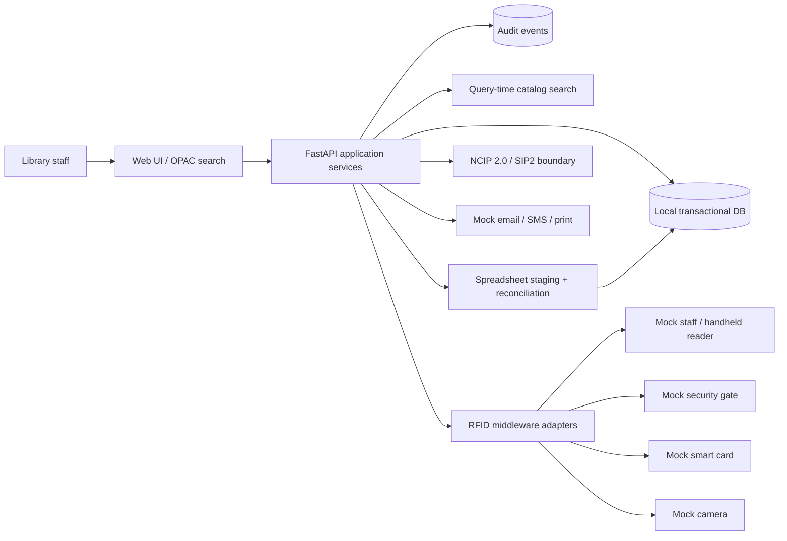

# Architecture package

## System context

The prototype is a self-contained web application with local transactional storage and explicitly mocked device/vendor boundaries. It does not connect to an institutional ILMS, physical RFID hardware, email, SMS, printing or CCTV. All people and records are synthetic.

## Seven layers

| SOP layer | Prototype module | Responsibility |
|---|---|---|
| User | app/templates/, app/static/ | Staff UI, catalog, members, circulation, migration, RFID console and system status |
| Application | app/main.py, app/services/ | Use cases, policy validation, reports, audit and migration |
| RFID middleware | app/adapters/mocks.py | Device-neutral mock operations for readers, gate, card, printer and camera |
| Interoperability | MockIlmsAdapter | Mock seam labelled NCIP/SIP2 boundary; no protocol conformance claimed |
| Data | app/database.py, app/models.py | SQLite transactional data, staging, audit, device events and gate events |
| Integration | app/adapters/mocks.py | Simulated ILMS, email, SMS, print and CCTV evidence seams |
| Operations | .env.example, scripts/, docs/ | Runtime configuration, health endpoint, setup, deployment and rollback guidance |

## Technology choices

- Python 3.11+ and FastAPI: concise API implementation and generated OpenAPI docs.
- SQLAlchemy 2: relational schema and data-access abstraction. SQLite is only for the local demo.
- HTML/CSS/vanilla JavaScript: low-friction UI without a frontend build pipeline. The stylesheet uses system fonts to support offline rendering.
- openpyxl: reads XLSX in read-only/data-only mode for migration staging.
- pytest and HTTPX: repeatable API regression checks.

## Data integrity

1. The prototype uses a separate local database; no live credentials or ILMS connection string are included.
2. A protocol adapter boundary is not permission to write to an ILMS. Production integration waits for authorised system/schema and field ownership review.
3. Import stages and validates records, checks accession uniqueness against the target, and inserts only after explicit commit. Existing books are not updated.
4. Rollback is tied to that batch's commit audit evidence, refuses tagged or circulated rows, and targets only the accession list captured by the batch.
5. Local SQLite transaction rollback is not institutional backup/restore proof.

## Adapter contracts

- Provide health, timeout, retry and correlation IDs at each real adapter.
- Production RFID events need durable IDs/idempotency, duplicate suppression and offline queue handling.
- NCIP/SIP2 must be implemented and tested against the actual ILMS profile before making protocol-support claims.
- Mock notification objects are queued only; no real message is sent.
- Camera references are mock:// URIs; no image capture occurs.

## Deployment topology (target, not validated)

Windows 11 workstation browser -> managed internal web service on Windows Server 2022 or later -> approved database, backup and log storage. Use a least-privilege service account, managed certificates, separate backup paths and no inbound internet dependency at runtime. Build and test an offline wheelhouse/installer before isolated-site deployment.

## Security boundary

All identities and records are synthetic. Demo endpoints are unauthenticated and must not be exposed to an untrusted network. Before any pilot add real authentication, route-level role authorization, secure sessions, CSRF controls, TLS, secret vaulting, rate limits, privacy/retention review, backup encryption, monitoring and a formal security assessment. No OEM, NCIP/SIP2, security, performance or certification claims are made.
